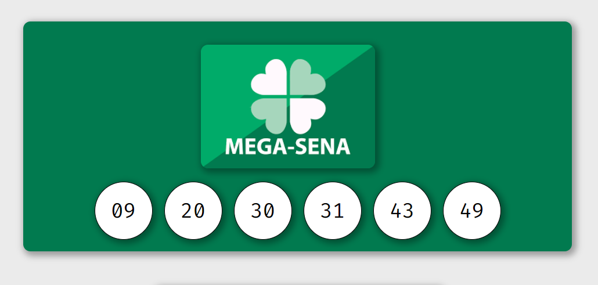
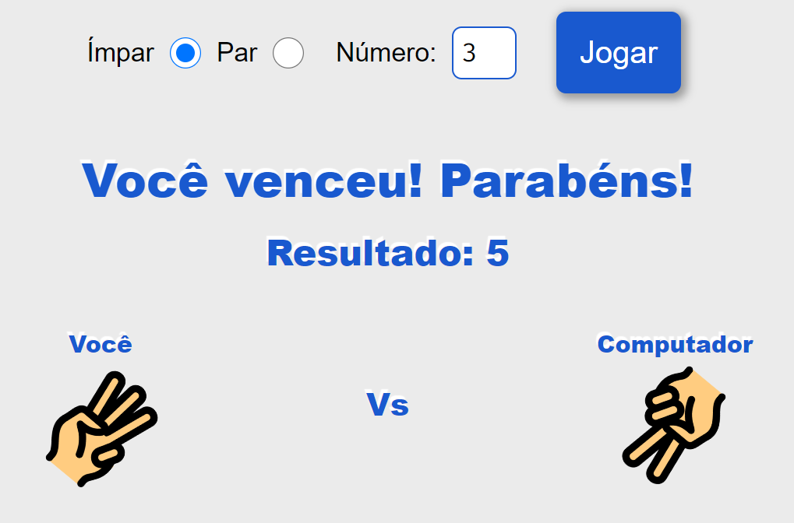
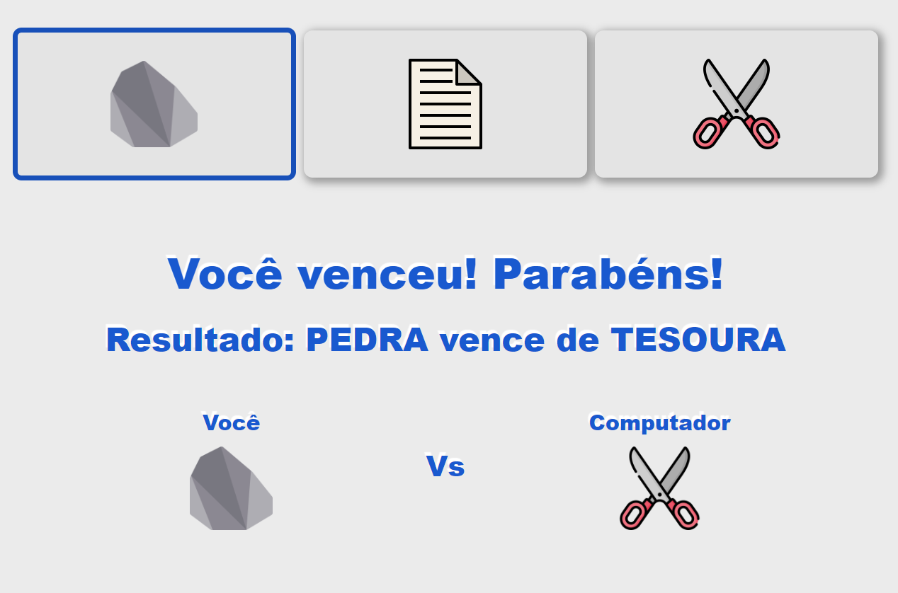
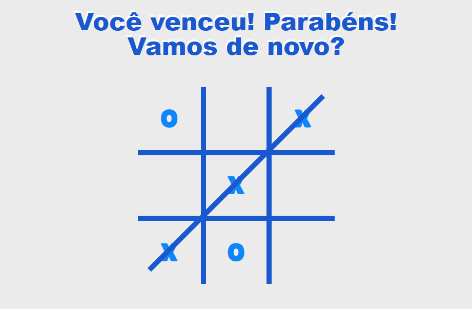
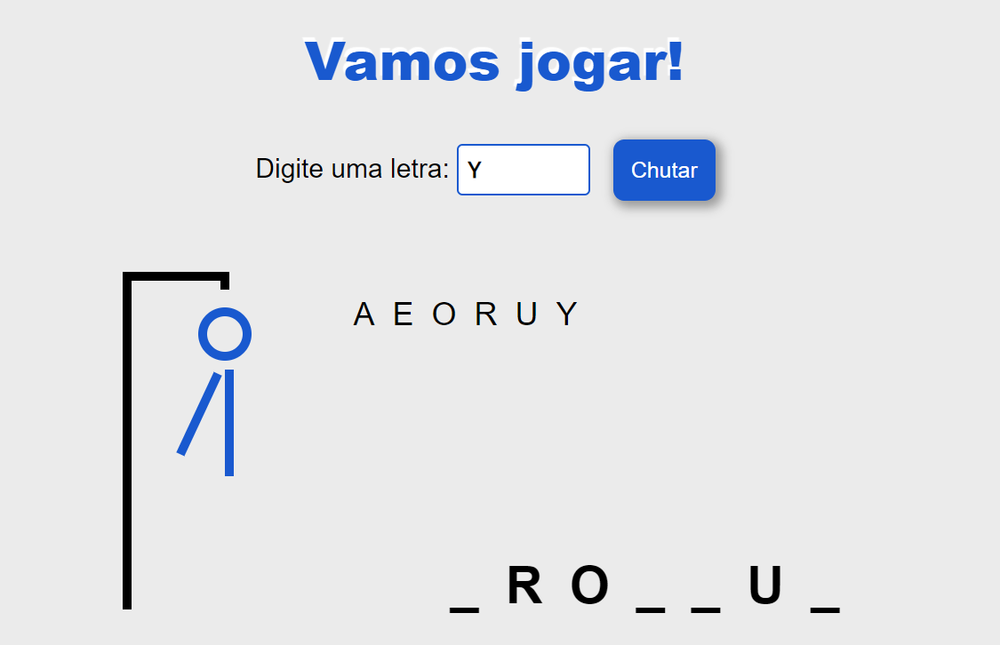

# MiniJogos!

4 minijogos diferentes envolvendo disputar com a sorte ou com o computador!

Visualização: [https://rafaelsantiagosilva.github.io/MiniJogos](https://rafaelsantiagosilva.github.io/MiniJogos/)

## Tecnologias usadas

## Mega-Sena

Um gerador de seis números aleatórios diferentes e que aparecem em ordem crescente, inspirado na mega-sena.

Visualização: [https://rafaelsantiagosilva.github.io/MiniJogos/src/pages/mega_sena.html](https://rafaelsantiagosilva.github.io/MiniJogos/src/pages/mega_sena.html)

## Impar ou Par!

Jogue ímpar ou par com o computador!

Visualização: [https://rafaelsantiagosilva.github.io/MiniJogos/src/pages/impar_ou_par.html](https://rafaelsantiagosilva.github.io/MiniJogos/src/pages/impar_ou_par.html)

## Pedra, Papel, Tesoura!

Tente a sorte neste famoso jogo contra o computador!

Visualização: [https://rafaelsantiagosilva.github.io/MiniJogos/src/pages/pedra_papel_tesoura.html](https://rafaelsantiagosilva.github.io/MiniJogos/src/pages/pedra_papel_tesoura.html)

## Jogo da Velha

Jogue contra um algoritmo neste nostálgico jogo.

Visualização: [https://rafaelsantiagosilva.github.io/MiniJogos/src/pages/pedra_papel_tesoura.html](https://rafaelsantiagosilva.github.io/MiniJogos/src/pages/jogo_da_velha.html)

## Jogo da Forca

Teste seus conhecimentos nerds neste jogo da forca de pokemon. Utiliza a [PokeAPI](https://pokeapi.co/).

Visualização: [https://rafaelsantiagosilva.github.io/MiniJogos/src/pages/pedra_papel_tesoura.html](https://rafaelsantiagosilva.github.io/MiniJogos/src/pages/jogo_da_forca.html)
